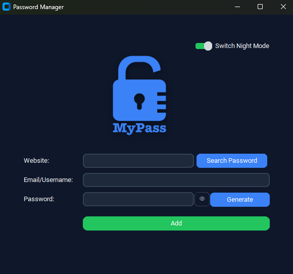

# MyPass – Password Manager

MyPass is a desktop password manager built with Python and CustomTkinter.
The application allows users to generate, store, and retrieve credentials through a simple and responsive interface.

## Features

* Generate strong random passwords
* Store credentials locally using JSON
* Search saved entries by website
* Automatically copy generated passwords to clipboard
* Toggle password visibility
* Dark and light mode with persistent user preference

##  Preview



## Tech Stack

* Python
* CustomTkinter (GUI)
* Tkinter
* PyInstaller (for packaging)

## Running the App

### From source

```bash
git clone https://github.com/yourusername/password-manager.git
cd password-manager
py -m pip install -r requirements.txt
py main.py
```

### Executable

Run the compiled executable:

```
MyPass.exe
```

No additional setup is required.

## Data Storage

Application data is stored locally:

* `data.json` – saved credentials
* `settings.json` – user preferences (theme)

Both files are created automatically when needed.

## Notes

This project stores data in plain text and is intended for learning purposes.
It focuses on UI/UX design, local data handling, and desktop application structure.

## Future Improvements

* Encryption for stored data
* Master password authentication
* Improved validation and error handling

## Author

Velizar Vesovic

